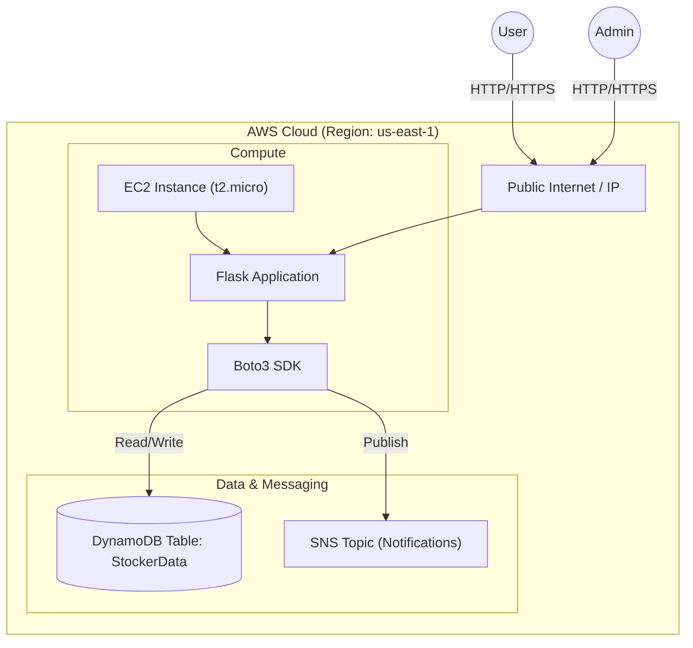

# Stocker System Documentation

## 1. System Architecture

The Stocker application is a monolithic Flask application deployed on AWS EC2, interacting with AWS managed services for persistence and messaging.

### Components
*   **Flask Application**: Handles HTTP requests, business logic, and session management.
*   **Boto3**: AWS SDK for Python, used to communicate with DynamoDB.
*   **DynamoDB**: Main data store using Single Table Design.
*   **EC2**: Hosts the application.

## 2. Database Schema Design (DynamoDB)

We utilize a **Single Table Design** pattern to store all entities in one table (`StockerData`). This ensures scalability and efficient data retrieval.

### Partition Key (PK) & Sort Key (SK) Patterns

| Entity | PK Pattern | SK Pattern | Attributes | Access Pattern |
| :--- | :--- | :--- | :--- | :--- |
| **User Profile** | `USER#<email>` | `PROFILE` | `password_hash`, `username`, `role`, `id` | `get_user(email)` |
| **Stock Metadata** | `STOCK#<symbol>` | `META` | `current_price`, `name`, `created_at` | `get_stock(symbol)`, `scan_all_stocks` |
| **Transaction** | `USER#<email>` | `TX#<timestamp>#<uuid>` | `action` (BUY/SELL), `qty`, `price`, `symbol` | `get_user_transactions(email)` |
| **Portfolio Holding** | `USER#<email>` | `HOLDING#<symbol>` | `quantity`, `updated_at` | `get_user_portfolio(email)` |

### Entity Relationships
*   **1-to-Many**: A User has many Transactions (`TX#...`).
*   **1-to-Many**: A User has many Portfolio Holdings (`HOLDING#...`).

## 3. User Manual

### For Administrators
**Access Level**: Requires account email `admin@stocker.com`.

1.  **Listing a New Stock**:
    *   Navigate to **Admin Panel** (top right).
    *   Fill in the "List New Stock" form:
        *   **Symbol**: Ticker (e.g., TSLA).
        *   **Name**: Company Name (e.g., Tesla Inc).
        *   **Price**: Initial listing price.
    *   Click **List Stock**.

2.  **Deleting a Stock**:
    *   In the Admin Panel, scroll to "Listed Stocks".
    *   Click the red **Delete** button next to the stock you wish to remove.
    *   *Note: This does not remove user holdings of that stock, only the ability to trade it further.*

### For Traders
**Access Level**: Any registered user.

1.  **Registration**:
    *   Go to Home Page -> Click **Get Started**.
    *   Enter Username, Email, and Password.

2.  **Buying Stocks**:
    *   Go to **Trade** page.
    *   Select a company from the "Stock Symbol" dropdown.
    *   *Tip: The estimated total price will update automatically.*
    *   Enter Quantity -> Click **Submit Order**.

3.  **Viewing Portfolio**:
    *   Go to **Dashboard**.
    *   Top card shows your "Total Portfolio Value" (calculated using real-time stock prices).
    *   "Your Portfolio" table details exactly what you own.
